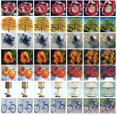
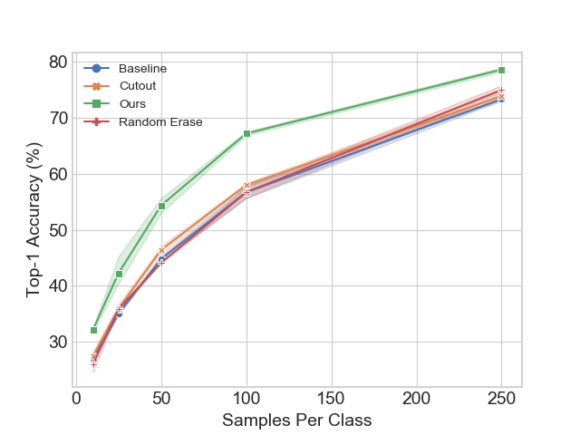

 
[](https://paperswithcode.com/sota/small-data-on-cifar-100-1000-labels-1?p=learning-from-small-data-through-sampling-an)
[](https://paperswithcode.com/sota/small-data-on-cub-200-2011-30-samples-per-1?p=learning-from-small-data-through-sampling-an)
[](https://paperswithcode.com/sota/small-data-on-cub-200-2011-5-samples-per-1?p=learning-from-small-data-through-sampling-an)
[](https://paperswithcode.com/sota/small-data-image-classification-on-cifar-10-1?p=learning-from-small-data-through-sampling-an)
# Generative Latent Implicit Conditional Optimization when Learning from Small Sample
[[Paper]](https://arxiv.org/abs/2003.14297) [[Poster]](figs/poster-glico.pdf) [[Talk]](https://www.cs.huji.ac.il/~daphna/presentations/ICPR%202020%20Azuri.mp4)

GLICO: Generative Latent Implicit Conditional Optimization when Learning from Small Sample, accepted to ICPR 2020 <br>
[Idan Azuri](https://www.linkedin.com/in/idan-a-aa572294/), [Daphna Weinshall](https://www.cse.huji.ac.il/~daphna/) <br>

 

    Left: Examples of synthesized images.Each row shows five new images
    (the intermediate columns), generated based on smooth interpolation in the
    latent space between two reconstructed images (the left and right columns).

    Right: Comparison of Top-1 Accuracy (including STE) for CIFAR-10 using
    WideResnet-28, with a different number of training examples per class (labeled
    data only). 


If you find this repository useful in your research, please cite the following paper:

    @misc{azuri2020generative,
        title={Generative Latent Implicit Conditional Optimization when Learning from Small Sample},
        author={Idan Azuri and Daphna Weinshall},
        year={2020},
        eprint={2003.14297},
        archivePrefix={arXiv},
        primaryClass={cs.LG}
    }

## 1. Requirements
* torch>= 1.3.0

* torchvision>=0.4.2

* easyargs


```console
dir=path-to-repo/learning-from-small-sample/glico_model
cd $dir
```


## 2. Datasets

The following datasets have been used in the paper:

- [Caltech UCSD Birds-200-2011][1] (CUB)
- [CIFAR-100][2] (CIFAR-100)

To experiment with differently sized variants of the CUB dataset, download the [modified image list files][3] files and unzip the obtained archive into the root directory of your CUB dataset
## 3.  Multiple shots on CUB


```console
UNLABELED=10
SEED=0

for SHOTS in 5 10 20 30; do
echo "glico CUB  samples per class: $SHOTS"
  # train

  s=" train_glico.py --rn my_test --d conv --pixel --z_init rndm --resume --tr --data cub --dim 512 --epoch 202 --fewshot --shot ${SHOTS} --seed ${SEED}"
  python3 $s
  echo $s

  sleep 15

  # eval

  s="evaluation.py -d resnet50 --pretrained --keyword  cub_my_test_10unsuprvised_pixel_classifier_conv_tr_fs_${SHOTS}  --is_inter  --augment --epoch 200 --data cub  --fewshot --shot ${SHOTS} --dim 512 --seed ${SEED}"
  echo $s
  python3 $s
done
```
## 4. Multiple shots on CIFAR-100
```console

UNLABELED=10
SEED=0


for SHOTS in 10 25 50 100; do
  echo "glico CIFAR100 samples per classt: $SHOTS"
  # train

  s="train_glico.py --rn  my_test_${UNLABELED}unsuprvised --fewshot --shot $SHOTS --d conv --pixel  --z_init rndm --resume --unlabeled_shot ${UNLABELED} --epoch 202 --noise_proj --tr --seed ${SEED} --dim 512"
  echo $s
  python3 $s

  sleep 15

  # eval

  s="evaluation.py -d wideresnet --keyword cifar-100_my_test_10unsuprvised_pixel_classifier_conv_tr_fs_${SHOTS}_ce_noise_proj --is_inter --augment --epoch 200 --data cifar --pretrained --fewshot --shot $SHOTS --unlabeled_shot ${UNLABELED} --loss_method ce --seed ${SEED} --dim 512"
  echo $s
  python3 $s
done
```

## 5. Baseline for CIFAR-100 
* Try the different flags: <br /> 
--random_erase<br /> 
--cutout<br /> 
--autoaugment <br /> 
or none of the above fro 'clean' baseline
* Choose the classifier architecture from the following: 
<br /> --d widerenset
<br /> --d resnet50
<br /> --d resnet (resnet110)
<br /> --d vgg (vgg19)
 ```
SHOTS=50
UNLABEL=1
SEED=0
echo " Baseline CIFAR random_erase shot: $SHOTS"
 s=" baseline_classification.py --epoch 200 -d wideresnet --augment --data cifar  --fewshot --shot  $SHOTS --unlabeled_shot 10 --seed ${SEED}"
echo $s
python3 $s
echo " Baseline CIFAR random_erase shot: $SHOTS"

```
[1]: http://www.vision.caltech.edu/visipedia/CUB-200-2011.html
[2]: https://www.cs.toronto.edu/~kriz/cifar.html
[3]: https://github.com/cvjena/semantic-embeddings/releases/download/v1.2.0/cub-subsampled-splits.zip
